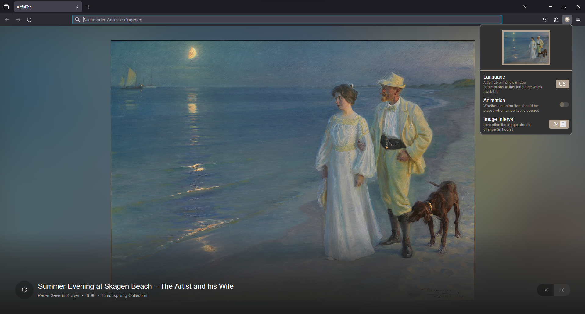

# ArtfulTab

Artful Tab is a browser extension that shows art from all over the world on the new New Tab page. Discover a new curated artwork from Wikimedia Commons every 24 hours. Get artist details and artwork information sourced from Wikidata.

[](https://addons.mozilla.org/en-US/firefox/addon/artful-tab/)

\
\


## Development

The extension manifest is defined in `src/manifest.js` and used in the vite config.

The popup and newTab entry points exist in the `src/entries` directory. 

Otherwise, the project functions just like a regular Vite project.

To switch between Manifest V2 and Manifest V3 builds, change the `MANIFEST_VERSION` variable in `vite.config.js`.

Refer to [@samrum/vite-plugin-web-extension](https://github.com/samrum/vite-plugin-web-extension) for more usage notes.

## Project Setup

```sh
npm install
```

## Commands
### Build
#### Development, HMR

Hot Module Reloading is used to load changes inline without requiring extension rebuilds and extension/page reloads
Currently only works in Chromium based browsers.
```sh
npm run dev
```

#### Development, Watch

Rebuilds extension on file changes. Requires a reload of the extension (and page reload if using content scripts)
```sh
npm run watch
```

#### Production

Minifies and optimizes extension build
```sh
npm run build
```

### Load extension in browser

Loads the contents of the dist directory into the specified browser
```sh
npm run serve:chrome
```

```sh
npm run serve:firefox
```

## Release
When you want to create a new release, follow these steps:

1. Update the version in the project's package.json file (e.g. 1.2.3)
1. Commit that change (`git commit -am v1.2.3`)
1. Tag the commit (`git tag v1.2.3`). Make sure your tag name's format is `v*.*.*` The workflow will use this tag to detect when to create a release
1. Push the changes to GitHub (`git push && git push --tags`)
1. Edit and publish the release draft created by the workflow in GitHub

After building successfully, the action will publish the release artifacts in a new release draft that will be created on GitHub.

